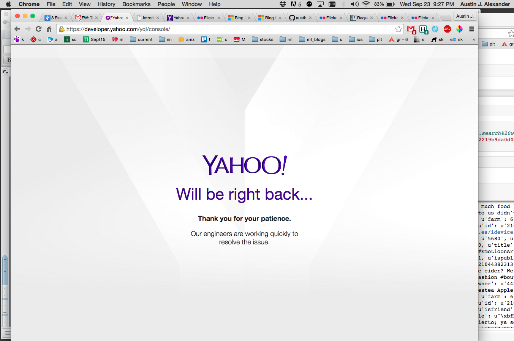

# gogetem
_images never had a chance..._

---

After quickly looking at Bing's (http://datamarket.azure.com/dataset/bing/search#schema) and YDN's (https://developer.yahoo.com/yql) respective APIs, I decided to give Yahoo a shot. Not only does Bing charge after a certain usage threshold, its documentation also lacks appeal on a few fronts (download .doc files? seriously?).

YDN has more visually-inviting documentation (at first glance at least), an interactive console, and its own query language. However, their pages crashed _numerous_ times while I was cruising around:  

Thus, since, as much as I could tell, I would simply be making use of Flickr's API via YDN's anyway (using YQL or REST query's such as: 'https://query.yahooapis.com/v1/public/yql?q=select%20*%20from%20flickr.photos.search%20where%20text%3D%22search_keyword%22%20and%20api_key%3D%22API_KEY%22&format=json&diagnostics=true&callback='), I decided simply to use Flickr's API directly. This decision may mean that I broke the rules. If so, please let me know. [N.B. There is a Python Flickr API (http://stuvel.eu/media/flickrapi-docs/documentation/1-intro.html), but I opted not to use it.]

The Flickr docs for photo search may be seen here: https://www.flickr.com/services/api/flickr.photos.search.html. An interface for exploring the behavior of this API by querying it may be found here: https://www.flickr.com/services/api/explore/flickr.photos.search.
